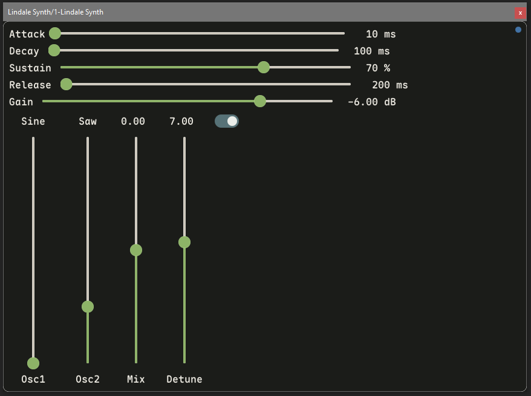

## Lindalë

Cross-platform audio plugin framework written in Odin. Currently targeting VST3 on Mac and Windows. Work in progress.

*Screenshot of a simple synth plugin built with the framework.*

My aim is to create a framework that's a joy to use to experiment with audio plugin development, and to have a long-term learning project. The project is built around a hot-reloading architecture, so that the core audio processing and rendering/UI code can be recompiled and reloaded on the fly without restarting the plugin or the DAW. This is common in game development, but as far as I know hasn't been done in the audio plugin environment before now. It's a huge benefit for iterating quickly while prototyping and learning DSP.

### Features
- Odin, not C++. The Joy of Programming. It's been wonderful.
- Plugin hot-reloading a separate DLL with atomic DLL swapping to not interrupt in-flight threads.
- Hardware-accelerated Metal/DX11 SDF instance shading for rendering UI elements and text with one shader.
- CLAY-style flexbox UI layout, with some UI primitives like buttons and sliders.
- A growing DSP library with filters, envelopes, very simple oscillators, etc.

### Setting up dev environment
- Select which plugin to build with `set_plugin.command <plugin>` (mac) / `set_plugin.bat <plugin>` (windows). This rewrites `src/bridge/plugin_id.odin`, the source-of-truth that the build scripts read. You can also pass the plugin name directly to a build script as a one-off override.
- Run `build_plugin.*` to build the selected plugin and install it. Each plugin builds into its own `out/<plugin>.vst3` bundle, and the script symlinks the bundle into the system VST3 folder (windows: `%LOCALAPPDATA%\Programs\Common\VST3`, mac: `~/Library/Audio/Plug-Ins/VST3`) and `out/hot` into the plugin's runtime folder (windows: `%APPDATA%\jagi\<plugin>`, mac: `~/Library/Application Support/jagi/<plugin>`).
- Because each plugin gets its own bundle, class UIDs, runtime folder and log directory, multiple Lindalë plugins can be built and loaded in a DAW side by side.

### On AI

I've been using Claude to help with this project, mostly in the platform layers and rendering code, the DSP which I'm still learning, and for debugging, and especially on OS X since I'm very inexperienced with that platform still. But I vet and modify the code it generates quite extensively.

### TODO:
- [x] Rewrite render backend to use metal/directx directly
- [x] Extend hot reloading:
  - [x] Move audio processing procedures into hotloaded code
  - [x] Add generation tracking to hotloader
  - [ ] Look into IComponentHandler::restartComponent for dynamic param configuration in VST3
- [x] Add a very basic DSP library with common primitives
- [ ] Add instrument plugin support in addition to effect plugin
- [ ] Provide a clean way of separating plugin project code from framework code
- [ ] Improve rendering
  - [ ] Better text rendering, move off of stb truetype
  - [ ] Lines and bezier curve shading for drawing scopes, etc.
  - [ ] Drop shadows, noise and gradients, juice..
- [ ] Improve UI (more complex layout, more UI element types, etc..)
- [ ] Get good at DSP
- [ ] Support CLAP/AAX/AU in addition to VST3