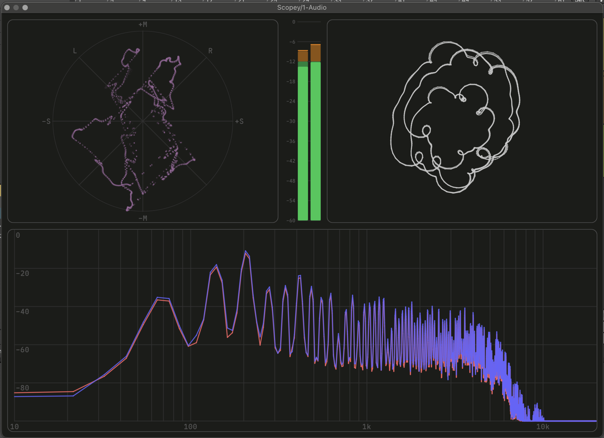

# Lindalë

Cross-platform audio plugin framework written in Odin, along with a working set of plugins I'm developing using it. Currently targeting VST3 on Mac and Windows. Idiosyncratic work in progress.

*Screenshot of a simple synth plugin built with the framework.*

My aim is to create a framework that's a joy to use to experiment with audio plugin development, and to have a long-term learning project. The project is built around a hot-reloading architecture, so that the core audio processing and rendering/UI code can be recompiled and reloaded on the fly without restarting the plugin or the DAW. This is common in game development, but as far as I know hasn't been done in the audio plugin environment before now. It's a huge benefit for iterating quickly while prototyping and learning DSP.

I'm using the Odin language, which I find a perfect fit for audio programming. Builtin complex types, great SIMD and atomic support, very nice cross-platform development with platform bindings and objective-C subclassing, straightforward ways of plumbing custom allocators and loggers, and simple procedural code.

## Features
- Hot-reloading of plugin implementation code via a separate DLL, with atomic swapping and double buffering so the in-flight audio thread is never interrupted.
- Hardware-accelerated Metal/DX11 SDF instance shading for rendering UI elements and text with one shader.
- CLAY-style flexbox UI layout, with some UI primitives like buttons and sliders, and support for custom-drawn canvas widgets.
- A growing DSP library with filters, envelopes, very simple oscillators, etc.
- A few plugins I'm starting to build to exercise all these pieces. A scope plugin with a few different audio visualization views, a simple synth, an emulator for the Atari POKEY chip oscillators.

## Setting up dev environment
- In theory, all you need is the latest Odin compiler installed and in your path. Along with a DAW to test in. I test regularly in Reaper and Ableton.
- All build commands go through a build 'script', written in Odin as well, in the root directory, named `build.odin`. Execute build commands by running `odin run . -- <command_name> [args]` while in the project root directory. Everything I mention below implicitly uses this format.
- Select which plugin to build with `select <plugin>`. This rewrites `src/bridge/plugin_id.odin`, the source-of-truth. You can also pass the plugin name directly to a build command as a one-off override.
- Run `build [plugin]` to build the selected or specified plugin, and install it. Each plugin builds into its own `out/<plugin>.vst3` bundle, and the script symlinks the bundle into a user VST3 folder (windows: `%LOCALAPPDATA%\Programs\Common\VST3`, mac: `~/Library/Audio/Plug-Ins/VST3`) and `out/hot` into the plugin's runtime folder.
- Run `hotbuild [plugin]` to build just the hot-loaded DLL for the selected or specified plugin. If a DAW is open with plugin instances, and hotloading isn't disabled, the running plugin instances will reload the UI and DSP code. Changes to the parameter list still require a full `build` and DAW reload.
- You can pass `-no-hot` to the `build` command to build one self-contained DLL.
- You can pass `-release` to the `build` or `hotbuild` commands to build an optimized build with no debug symbols.
- Because each plugin gets its own bundle, class UIDs, runtime folder and log directory, multiple Lindalë plugins can be built and loaded in a DAW side by side.

## Creating a new plugin
Start with the `plugin_template.odin` file in `src/lindale`, clone it, and rename it something you want. Rename all the data definitions and procedures. Then finally, add another clause to the chained `when` statements in `src/lindale/plugin_def.odin`, with your new plugin. You can then run the build commands to select and build your plugin.

## On AI

I've been using Claude to help with this project, mostly in the platform layers and rendering code, the DSP, which I'm still learning, and for debugging. In particular, I've leaned on Claude for MacOS specific code, since I'm very inexperienced with that platform still. But I vet and modify the code it generates extensively before committing.

## Roadmap
- DSP experimentation and improvements
- Rendering / UI improvements and customizability
- Support for more plugin formats beyond VST3
- Documentation and developer experience improvements
